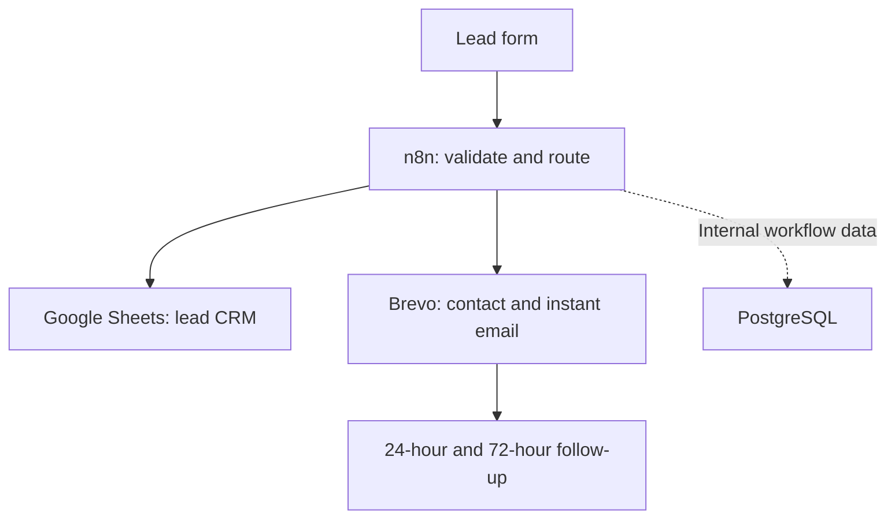

# Lead Capture & Automated Follow-Up

[](https://app.notion.com/p/3c1c3b53d92c81c9a2ced456e1c62623?pvs=204)
[](https://www.loom.com/share/d7e0d72a55f742ef8522d0315765643f)
[](LICENSE)

A portfolio demonstration of a practical lead-capture, CRM-routing, and email follow-up system for a fictional Roatán guest-services business.

> This repository uses fictional sample data. It does not claim live client results, and it contains no production credentials.

## Portfolio projects

- **Lead Capture & Automated Follow-Up** — the webhook, Google Sheets CRM, and Brevo follow-up project documented in this root README.
- **[HarborGlow Lead Qualification & Routing — SIMULATED](projects/harborglow-lead-qualification/README.md)** — a HubSpot and n8n lead-scoring and routing system with explainable rules, CRM write-back, duplicate-processing prevention, and documented QA.

## Business problem

- Online inquiries can arrive outside office hours.
- Manual responses create delays and missed opportunities.
- Leads are scattered across inboxes instead of one shared CRM.
- Ownership and response deadlines are unclear.
- Follow-up depends on memory.

## Solution



| Component | Implementation | Business value |
|---|---|---|
| n8n workflow | Webhook intake, validation, normalization, routing, API requests, and JSON response | Processes every inquiry consistently |
| Google Sheets CRM | Lead, owner, priority, SLA, status, deadline, and notes | Creates visibility and accountability |
| Brevo automation | Contact creation, list enrollment, instant email, and timed follow-up | Reduces response time and keeps leads engaged |
| Docker + PostgreSQL | Local n8n deployment with persistent internal storage | Provides a reproducible technical demo |

## Routing rules

| Service | Priority | Owner | Response target |
|---|---|---|---|
| Airport Transfer | Urgent | Operations | 10 minutes |
| Tour Booking | High | Sales — Tours | 15 minutes |
| Vacation Rental | High | Reservations | 15 minutes |
| General Inquiry | Normal | Customer Care | 30 minutes |

The routing logic is implemented in [`scripts/routing.js`](scripts/routing.js) and mirrored in the sanitized n8n workflow.

## Tested outcomes

- [x] Webhook accepted a test inquiry
- [x] Email validation and routing completed
- [x] Lead record reached the sample CRM structure
- [x] Phone number was handled as text
- [x] Brevo contact payload and list enrollment were generated
- [x] Instant acknowledgement was triggered
- [x] Contact entered the follow-up sequence
- [x] Credentials remained outside the workflow export

## Repository structure

```text
.
├── docs/
│   ├── case-study.md
│   └── setup-guide.md
├── workflows/
│   └── lead-capture-follow-up.sanitized.json
├── sample-data/
│   ├── crm-template.csv
│   └── test-lead.json
├── scripts/
│   └── routing.js
├── tests/
│   └── routing.test.js
├── docker-compose.yml
├── .env.example
└── README.md
```

## Quick start

Requirements: Docker Desktop or Docker Engine with Compose.

```bash
cp .env.example .env
docker compose up -d
```

Then open `http://localhost:5678`, create an n8n owner account, import the sanitized workflow, and configure your own Google Sheets and Brevo credentials. See the [setup guide](docs/setup-guide.md) for details.

## Run the routing tests

```bash
npm test
```

No third-party Node packages are required.

## Security decisions

- Secrets are supplied through credentials or environment variables, never committed.
- Workflow exports use placeholder credential references.
- Sample data is fictional.
- Google Sheets stores business lead records; PostgreSQL stores n8n's internal application data.
- Automated messages acknowledge and route inquiries; humans retain control of quotes, commitments, and sensitive decisions.

## About the builder

**Carl Bodden** is a bilingual Marketing Automation Specialist based in Roatán, Honduras. He combines digital marketing, CRM operations, and technical workflow automation to build maintainable systems for lead management and follow-up.

[LinkedIn](https://www.linkedin.com/in/carl-bodden26) · [Notion portfolio](https://app.notion.com/p/3c1c3b53d92c81c9a2ced456e1c62623?pvs=204) · [Email](mailto:clifford.bodden100@gmail.com)

**Roatán Marketing Automations — Grow. Scale. Connect.**
