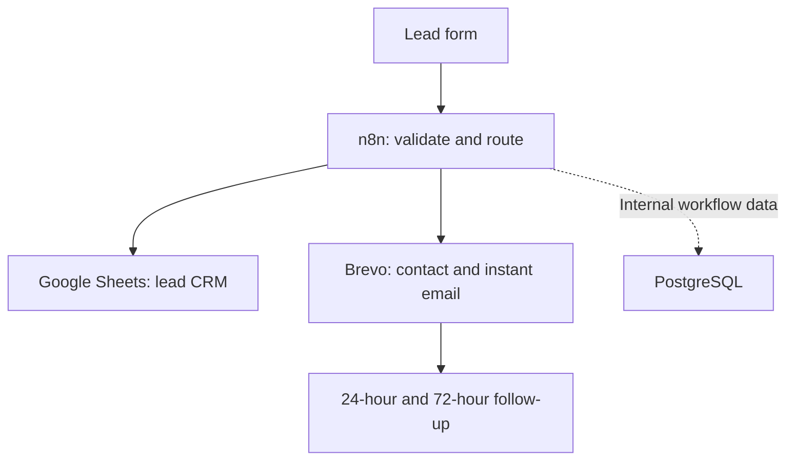

# Carl Bodden — Marketing Automation Portfolio

[](https://carlbodden.notion.site/Carl-Bodden-Marketing-Automation-Portfolio-3c1c3b53d92c81c9a2ced456e1c62623)
[](https://www.linkedin.com/in/carl-bodden26)
[](projects/harborglow-lead-qualification/README.md)
[](LICENSE)

I build practical CRM, lead-management, and follow-up systems using **HubSpot, n8n, JavaScript, Google Workspace, Brevo, Docker, and PostgreSQL**.

> **Portfolio disclosure:** These projects use fictional businesses and simulated data. They demonstrate system design, implementation, testing, documentation, and security decisions—not live client performance.

## Recruiter snapshot

| Area | Evidence in this repository |
|---|---|
| Target roles | Marketing Automation, CRM Operations, RevOps Support, Digital Marketing Operations |
| Core strengths | Lead capture, explainable scoring, CRM routing, automated follow-up, API integration, QA documentation |
| Working style | Bilingual English/Spanish, systems-minded, security-conscious, clear documentation |
| Technical proof | Importable sanitized workflows, JavaScript rules, scoring documentation, test evidence, and screenshots |

## Featured project — HarborGlow Lead Qualification & Routing

**HubSpot + n8n + JavaScript | Explainable 0–100 scoring | CRM write-back | SIMULATED**

[](projects/harborglow-lead-qualification/README.md)
[](projects/harborglow-lead-qualification/workflows/harborglow-lead-qualification-routing-simulated.json)
[](projects/harborglow-lead-qualification/docs/test-results.md)


I designed and validated a workflow that finds pending HubSpot contacts, scores each lead across five explainable dimensions, assigns a qualification status and next best action, writes five decision fields back to HubSpot, and prevents routine duplicate processing.

### What recruiters can verify

- Transparent 0–100 scoring across ZIP fit, service value, frequency, home fit, and urgency.
- Routing for qualified, nurture, missing-information, and outside-service-area scenarios.
- HubSpot write-back for score, summary, status, disqualification reason, and next best action.
- A past-date regression test that prevents expired service dates from adding urgency points.
- A sanitized n8n export with no credentials, pinned data, execution history, or local instance identifiers.

[Open the complete HarborGlow case study →](projects/harborglow-lead-qualification/README.md)

---

## Additional project — Lead Capture & Automated Follow-Up

[](https://www.loom.com/share/d7e0d72a55f742ef8522d0315765643f)

A lead-capture, Google Sheets CRM, and Brevo email-follow-up demonstration for a fictional Roatán guest-services business.

### Business problem

- Online inquiries can arrive outside office hours.
- Manual responses create delays and missed opportunities.
- Leads are scattered across inboxes instead of one shared CRM.
- Ownership and response deadlines are unclear.
- Follow-up depends on memory.

### Solution architecture



| Component | Implementation | Business value |
|---|---|---|
| n8n workflow | Webhook intake, validation, normalization, routing, API requests, and JSON response | Processes every inquiry consistently |
| Google Sheets CRM | Lead, owner, priority, SLA, status, deadline, and notes | Creates visibility and accountability |
| Brevo automation | Contact creation, list enrollment, instant email, and timed follow-up | Keeps test leads moving through a documented follow-up path |
| Docker + PostgreSQL | Local n8n deployment with persistent internal storage | Provides a reproducible technical demo |

### Tested outcomes

- [x] Webhook accepted a fictional test inquiry
- [x] Email validation and routing completed
- [x] Lead record reached the sample CRM structure
- [x] Phone number was handled as text
- [x] Brevo contact payload and list enrollment were generated
- [x] Instant acknowledgement was triggered
- [x] Contact entered the follow-up sequence
- [x] Credentials remained outside the workflow export

## Repository structure

```text
.
├── projects/
│   └── harborglow-lead-qualification/
│       ├── assets/
│       ├── docs/
│       ├── workflows/
│       └── README.md
├── docs/
│   ├── case-study.md
│   └── setup-guide.md
├── workflows/
│   └── lead-capture-follow-up.sanitized.json
├── sample-data/
├── scripts/
├── tests/
├── docker-compose.yml
└── README.md
```

## Security decisions

- Secrets are supplied through credentials or environment variables, never committed.
- Workflow exports use placeholder or removed credential references.
- Sample data is fictional.
- Automated outputs support human teams; people retain control of quotes, commitments, and sensitive decisions.
- Public documentation distinguishes simulated technical validation from real business outcomes.

## About the builder

**Carl Bodden** is a bilingual English/Spanish Marketing Automation Specialist based in Roatán, Honduras. He combines digital marketing, CRM operations, and technical workflow automation to build maintainable lead-management and follow-up systems.

[LinkedIn](https://www.linkedin.com/in/carl-bodden26) · [Public Notion portfolio](https://carlbodden.notion.site/Carl-Bodden-Marketing-Automation-Portfolio-3c1c3b53d92c81c9a2ced456e1c62623) · [Email](mailto:clifford.bodden100@gmail.com)

**Roatán Marketing Automations — Grow. Scale. Connect.**
