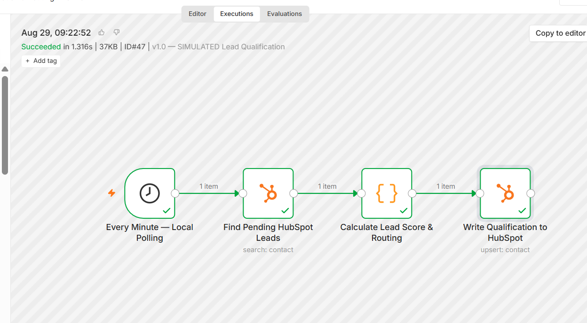
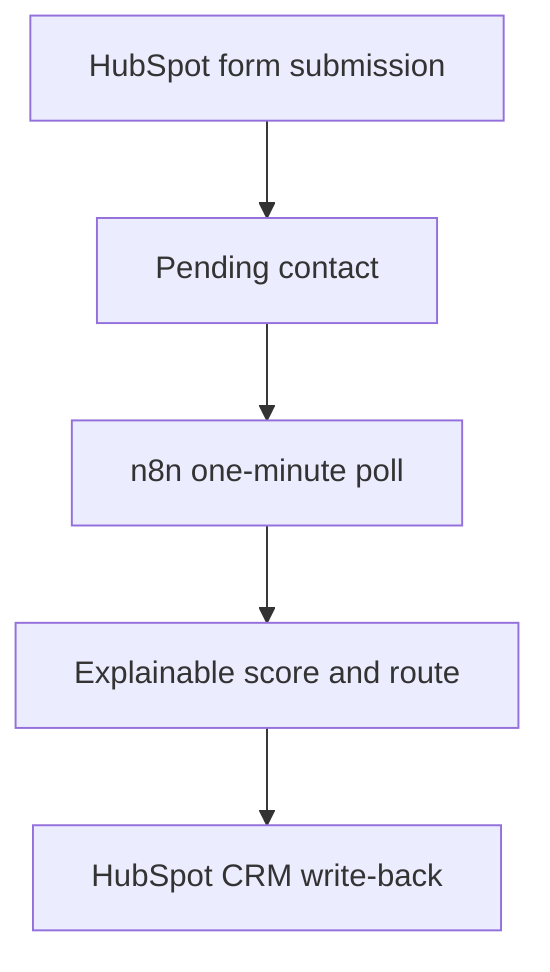

# HarborGlow Lead Qualification & Routing — SIMULATED


[](https://carlbodden.notion.site/Carl-Bodden-Marketing-Automation-Portfolio-3c1c3b53d92c81c9a2ced456e1c62623)

An explainable lead-qualification and CRM-routing demonstration for **HarborGlow Home Cleaning**, a fictional local-service company in Tampa, Florida.

> **Portfolio disclosure:** Every company, contact, score, and test result in this project is fictional and **SIMULATED**. This version uses deterministic business rules—not machine learning or an LLM—so every decision can be explained and audited.

## Recruiter quick view

| Signal | Evidence |
|---|---|
| Role alignment | Marketing Automation, CRM Operations, RevOps Support |
| Stack | HubSpot, n8n, JavaScript, Docker |
| System built | Pending-contact search, 0–100 scoring, decision routing, and CRM write-back |
| Quality proof | Positive-path tests, outside-area routing, past-date regression, and duplicate-prevention check |
| Security proof | Sanitized inactive workflow with no credentials, pinned data, execution payloads, or instance identifiers |

### Inspect the evidence

[](workflows/harborglow-lead-qualification-routing-simulated.json)
[](docs/scoring-model.md)
[](docs/test-results.md)



*A successful end-to-end n8n execution: scheduled polling → HubSpot search → explainable scoring and routing → HubSpot write-back.*

## Business problem

Local-service teams can lose opportunities when new inquiries are reviewed inconsistently, sales-ready leads wait too long, or contacts outside the service area consume sales time.

This workflow standardizes the first qualification decision by:

- finding HubSpot contacts marked `Pending Qualification`;
- calculating a transparent score from 0–100;
- assigning a qualification status and next best action;
- writing the result back to HubSpot; and
- preventing processed contacts from being selected again.

## Architecture



The one-minute schedule is a **local portfolio simulation**. A production implementation would normally use a secured public webhook or hosted event-driven workflow where supported.

## Workflow nodes

| Node | Responsibility |
|---|---|
| Every Minute — Local Polling | Starts the local near-real-time check |
| Find Pending HubSpot Leads | Retrieves up to 10 pending contacts |
| Calculate Lead Score & Routing | Calculates the score, status, reason, summary, and next action |
| Write Qualification to HubSpot | Updates the contact using mapped HubSpot properties |

## Scoring model

| Dimension | Maximum points |
|---|---:|
| Tampa service-area ZIP fit | 25 |
| Service value | 20 |
| Cleaning frequency / retention value | 20 |
| Home / job fit | 15 |
| Service-date urgency | 20 |
| **Total** | **100** |

See the complete rules in [docs/scoring-model.md](docs/scoring-model.md).

## Routing decisions

| Condition | Status | Next best action |
|---|---|---|
| Required information missing | Needs More Information | Request More Information |
| ZIP outside the service area | Unqualified | Mark Unqualified |
| Score 85–100 | Qualified | Call Immediately |
| Score 70–84 | Qualified | Send Estimate |
| Score 50–69 | Nurture | Begin Nurture Sequence |
| Score below 50 | Needs More Information | Human Review |

Outside-area contacts also receive the reason `Outside Service Area`.

## HubSpot write-back

The workflow updates these contact properties:

- `AI Lead Score`
- `AI Summary`
- `Lead Qualification Status`
- `Disqualification Reason`
- `Next Best Action`

Every generated summary begins with `SIMULATED rule-based qualification` to prevent the demonstration from being mistaken for a real client result or an LLM-generated assessment.

## Validated outcomes

- A 75-point fictional lead was marked **Qualified** and routed to **Send Estimate**.
- An 80-point fictional lead was marked **Qualified** and routed to **Send Estimate**.
- A fictional lead outside the Tampa service area was marked **Unqualified**, assigned **Outside Service Area**, and routed to **Mark Unqualified**.
- A past-date regression test returned **0 urgency points**, confirming that expired dates do not inflate the score.
- Re-running the search after processing returned zero items, confirming duplicate-processing prevention.
- No credentials, contact records, execution payloads, or local instance identifiers are included in the public workflow file.

See [docs/test-results.md](docs/test-results.md) for the evidence matrix.

## Import and configure

1. Run n8n locally or in a controlled hosted environment.
2. Import [`workflows/harborglow-lead-qualification-routing-simulated.json`](workflows/harborglow-lead-qualification-routing-simulated.json).
3. Create your own HubSpot credential with only the permissions required for contact read/write and contact-schema read access.
4. Select that credential in both HubSpot nodes.
5. Create or map the required HubSpot contact properties and dropdown values listed above.
6. Test with fictional data before publishing the workflow.

The sanitized workflow imports **inactive** so it cannot begin polling before the new owner configures credentials and validates the mappings.

## Security and design decisions

- Secrets remain in n8n credentials and are never committed.
- Export-specific workflow, version, instance, and credential-reference IDs were removed.
- The public workflow contains no pinned sample data or execution history.
- Deterministic rules make the score explainable and auditable.
- Processed contacts leave the pending queue, preventing routine reprocessing.
- Human teams retain responsibility for estimates, calls, and final customer decisions.

## Limitations and production path

- This is a portfolio simulation, not evidence of live revenue performance.
- The current design polls once per minute because n8n runs locally without a public webhook endpoint.
- The scoring model should be calibrated with consented historical conversion data before production use.
- A production design should add monitoring, error handling, rate-limit protection, ownership assignment, and controlled customer or internal notifications.

## Project structure

```text
harborglow-lead-qualification/
├── assets/
│   └── n8n-workflow-success.png
├── docs/
│   ├── scoring-model.md
│   └── test-results.md
├── workflows/
│   └── harborglow-lead-qualification-routing-simulated.json
└── README.md
```

## About the builder

**Carl Bodden** is a bilingual English/Spanish Marketing Automation Specialist based in Roatán, Honduras. He builds practical CRM, lead-management, and follow-up systems using HubSpot, n8n, Google Workspace, Brevo, and related tools.

[LinkedIn](https://www.linkedin.com/in/carl-bodden26) · [Public Notion portfolio](https://carlbodden.notion.site/Carl-Bodden-Marketing-Automation-Portfolio-3c1c3b53d92c81c9a2ced456e1c62623) · [Portfolio index](../../README.md)
