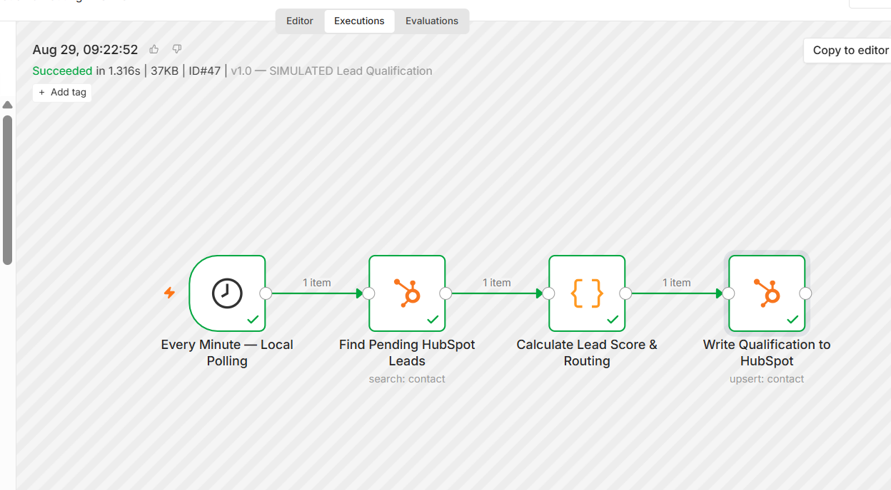
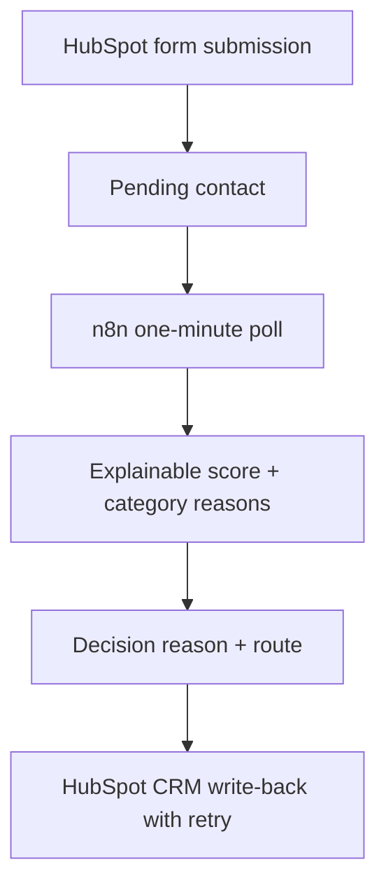

# HarborGlow Lead Qualification & Routing — SIMULATED


[](https://carlbodden.notion.site/Carl-Bodden-Marketing-Automation-RevOps-AI-Portfolio-3d5c3b53d92c8156930bd73ff7ad3d91)

An explainable lead-qualification and CRM-routing demonstration for **HarborGlow Home Cleaning**, a fictional local-service company in Tampa, Florida.

> **Portfolio disclosure:** Every company, contact, score, and test result in this project is fictional and **SIMULATED**. This version uses deterministic business rules—not machine learning or an LLM—so every decision can be explained and audited.

## Recruiter quick view

| Signal | Evidence |
|---|---|
| Role alignment | Marketing Automation, CRM Operations, RevOps Support |
| Stack | HubSpot, n8n, JavaScript, Docker |
| System built | Pending-contact search, 0–100 scoring, explainable decision reasons, routing, and CRM write-back |
| Quality proof | Positive-path tests, outside-area routing, past-date regression, duplicate-prevention check, and configured HubSpot retry handling |
| Security proof | Sanitized inactive workflow with no credentials, pinned data, execution payloads, or instance identifiers |

### Inspect the evidence

[](workflows/harborglow-lead-qualification-routing-simulated.json)
[](docs/scoring-model.md)
[](docs/test-results.md)



*A successful end-to-end n8n execution: scheduled polling → HubSpot search → explainable scoring and routing → HubSpot write-back.*

## Business problem

Local-service teams can lose opportunities when new inquiries are reviewed inconsistently, sales-ready leads wait too long, or contacts outside the service area consume sales time.

This workflow standardizes the first qualification decision by:

- finding HubSpot contacts marked `Pending Qualification`;
- calculating a transparent score from 0–100;
- generating category-level qualification reasons and a separate decision reason;
- assigning a qualification status and next best action;
- retrying HubSpot read/write operations up to three times after temporary failures;
- writing the result back to HubSpot; and
- preventing processed contacts from being selected again.

## Architecture


```mermaid
flowchart TD
    A["HubSpot form submission"] --> B["Pending contact"]
    B --> C["n8n one-minute poll"]
    C --> D["Explainable score + category reasons"]
    D --> E["Decision reason + route"]
    E --> F["HubSpot CRM write-back with retry"]
```

The one-minute schedule is a **local portfolio simulation**. A production implementation would normally use a secured public webhook or hosted event-driven workflow where supported.

## Workflow nodes

| Node | Responsibility |
|---|---|
| Every Minute — Local Polling | Starts the local near-real-time check |
| Find Pending HubSpot Leads | Retrieves up to 10 pending contacts; retries up to 3 times with a 3-second delay after failure |
| Calculate Lead Score & Routing | Calculates the score, category-level qualification reasons, decision reason, status, summary, and next action |
| Write Qualification to HubSpot | Updates the mapped HubSpot properties; retries up to 3 times with a 3-second delay after failure |

## Scoring model

| Dimension | Maximum points |
|---|---:|
| Tampa service-area ZIP fit | 25 |
| Service value | 20 |
| Cleaning frequency / retention value | 20 |
| Home / job fit | 15 |
| Service-date urgency | 20 |
| **Total** | **100** |

See the complete rules in [docs/scoring-model.md](docs/scoring-model.md).

## Routing decisions

| Condition | Status | Next best action |
|---|---|---|
| Required information missing | Needs More Information | Request More Information |
| ZIP outside the service area | Unqualified | Mark Unqualified |
| Score 85–100 | Qualified | Call Immediately |
| Score 70–84 | Qualified | Send Estimate |
| Score 50–69 | Nurture | Begin Nurture Sequence |
| Score below 50 | Needs More Information | Human Review |

Outside-area contacts also receive the reason `Outside Service Area`.

### Explainable decision output

The scoring node now returns three related explanation fields:

- `qualification_reasons` — one explanation for each scoring category, including the points awarded;
- `decision_reason` — the rule that determined the final route, including override rules such as missing information or an outside-area ZIP;
- `qualification_summary` — a readable combined summary used for CRM write-back.

The explanations are generated from the same deterministic rules that calculate the score. They are not generated by an LLM.


## HubSpot write-back

The workflow updates these contact properties:

- `AI Lead Score`
- `AI Summary`
- `Lead Qualification Status`
- `Disqualification Reason`
- `Next Best Action`

Every generated summary begins with `SIMULATED rule-based qualification` to prevent the demonstration from being mistaken for a real client result or an LLM-generated assessment.

## Reliability handling

Both HubSpot nodes have n8n `Retry On Fail` enabled with **3 maximum tries** and **3,000 ms between attempts**. This configuration is intended to handle short-lived API or network failures without immediately ending the workflow. A controlled retry/failure test is still pending and is listed in the QA plan rather than reported as a validated result.

## Validated outcomes

- A 75-point fictional lead was marked **Qualified** and routed to **Send Estimate**.
- An 80-point fictional lead was marked **Qualified** and routed to **Send Estimate**.
- A fictional lead outside the Tampa service area was marked **Unqualified**, assigned **Outside Service Area**, and routed to **Mark Unqualified**.
- A past-date regression test returned **0 urgency points**, confirming that expired dates do not inflate the score.
- Re-running the search after processing returned zero items, confirming duplicate-processing prevention.
- No credentials, contact records, execution payloads, or local instance identifiers are included in the public workflow file.

See [docs/test-results.md](docs/test-results.md) for the evidence matrix and the prepared QA cases for the current enhancement.

## Import and configure

1. Run n8n locally or in a controlled hosted environment.
2. Import [`workflows/harborglow-lead-qualification-routing-simulated.json`](workflows/harborglow-lead-qualification-routing-simulated.json).
3. Create your own HubSpot credential with only the permissions required for contact read/write and contact-schema read access.
4. Select that credential in both HubSpot nodes.
5. Create or map the required HubSpot contact properties and dropdown values listed above.
6. Test with fictional data before publishing the workflow.

The sanitized workflow imports **inactive** so it cannot begin polling before the new owner configures credentials and validates the mappings.

## Security and design decisions

- Secrets remain in n8n credentials and are never committed.
- Export-specific workflow, version, instance, and credential-reference IDs were removed.
- The public workflow contains no pinned sample data or execution history.
- Deterministic rules make the score explainable and auditable.
- Category-level reasons and a separate decision reason make the final route traceable.
- HubSpot read/write nodes are configured for up to three attempts with a three-second interval.
- Processed contacts leave the pending queue, preventing routine reprocessing.
- Human teams retain responsibility for estimates, calls, and final customer decisions.

## Limitations and production path

- This is a portfolio simulation, not evidence of live revenue performance.
- The current design polls once per minute because n8n runs locally without a public webhook endpoint.
- The scoring model should be calibrated with consented historical conversion data before production use.
- The current retry configuration handles simple transient failures, but a production design should still add structured final-failure logging, rate-limit-aware backoff, monitoring, ownership assignment, and controlled customer or internal notifications.

## Project structure

```text
harborglow-lead-qualification/
├── assets/
│   └── n8n-workflow-success.png
├── docs/
│   ├── scoring-model.md
│   └── test-results.md
├── workflows/
│   └── harborglow-lead-qualification-routing-simulated.json
└── README.md
```

## About the builder

**Carl Bodden** is a bilingual English/Spanish Marketing Automation Specialist based in Roatán, Honduras. He builds practical CRM, lead-management, and follow-up systems using HubSpot, n8n, Google Workspace, Brevo, and related tools.

[LinkedIn](https://www.linkedin.com/in/carl-bodden26) · [Public Notion portfolio](https://carlbodden.notion.site/Carl-Bodden-Marketing-Automation-RevOps-AI-Portfolio-3d5c3b53d92c8156930bd73ff7ad3d91) · [Portfolio index](../../README.md)
